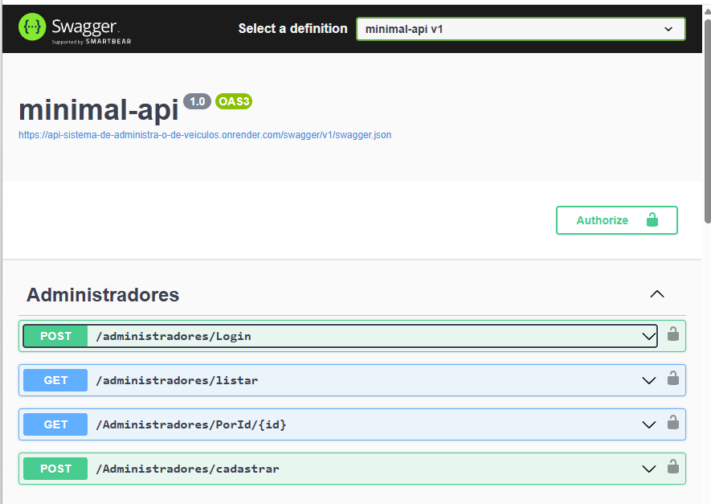
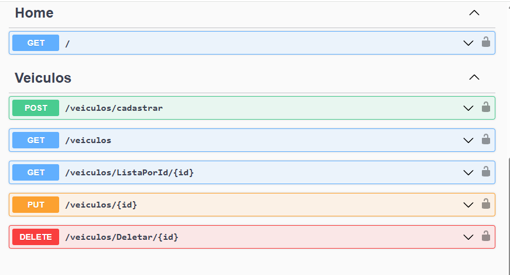
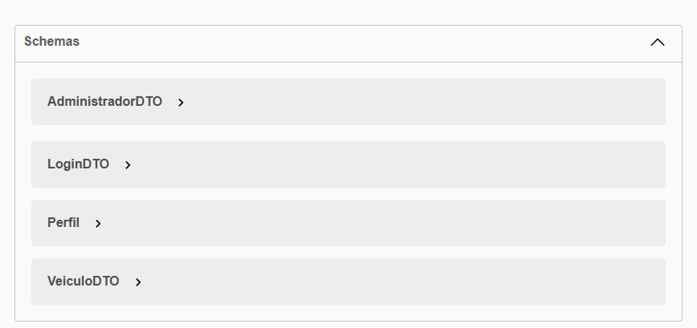

#!/bin/bash

# Este script emula a criação e exibição do arquivo README.md
# O conteúdo abaixo está no formato Markdown e pronto para ser copiado para seu GitHub.

cat << 'EOF'
# 🚀 Minimal API .NET 8: Sistema de Administração de Veículos 🛠️

Uma API REST completa, desenvolvida com **.NET 8 Minimal API**, que implementa um sistema seguro de **Gestão de Administradores e Veículos**.

O projeto utiliza **Autenticação JWT** e controle de acesso por **Roles** (`adm`, `editor`) para proteger rotas.

---

## 🌐 Deploy Online e Documentação Interativa

A API está hospedada e conteinerizada no **Render** com MySQL.

**Clique para interagir com o Swagger UI em Produção:**
[https://api-sistema-de-administra-o-de-veiculos.onrender.com/swagger/index.html](https://api-sistema-de-administra-o-de-veiculos.onrender.com/swagger/index.html)

### Visão Geral da API Online

Visualize a estrutura dos endpoints e dos DTOs:

<div align="center">
    
    
    
</div>

---

## 🧰 Stack Tecnológica Principal

| Tecnologia | Função no Projeto | Detalhes |
| :--- | :--- | :--- |
| **.NET 8** | Backend (Minimal API) | Foco em performance e endpoints concisos. |
| **MySQL** | Banco de Dados | Persistência de dados relacional. |
| **EF Core** | Mapeamento ORM | Gerenciamento de schema e migrações. |
| **JWT** | Segurança | Autenticação com Bearer Token. |
| **Docker** | Deploy | Imagem multi-stage leve para produção. |

---

## 🔐 Autenticação e Autorização (JWT com Roles)

A API requer autenticação via **JWT Bearer Token** para a maioria das rotas.

### Perfis de Acesso
| Perfil | Descrição |
| :--- | :--- |
| **`adm`** | **Acesso Total:** CRUD em Administradores e Veículos. |
| **`editor`** | **Acesso Limitado:** CRUD em Veículos, excluindo exclusão/atualização de Administradores. |

### Dados de Acesso Inicial (Para Teste)
O banco de dados foi inicializado via EF Core Migrations com a seguinte conta:
* **Endpoint:** `POST /administradores/Login`
* **Email:** `administrador@teste.com`
* **Senha:** `123456`
* **Perfil:** `adm`

---

## 🏁 Endpoints em Destaque

### 👥 **Administradores**
| Método | Rota | Autorização |
| :--- | :--- | :--- |
| `POST` | `/administradores/Login` | ❌ Público |
| `GET` | `/administradores/listar` | ✅ `adm` |
| `POST` | `/Administradores/cadastrar` | ✅ `adm` |

### 🚗 **Veículos**
| Método | Rota | Autorização | Validações |
| :--- | :--- | :--- | :--- |
| `POST` | `/veiculos/cadastrar` | ✅ `adm`, `editor` | `Nome`, `Marca` (não vazios), `Ano >= 1950`. |
| `GET` | `/veiculos` | ✅ Autenticado | Nenhuma |
| `PUT` | `/veiculos/{id}` | ✅ `adm` | Validações de cadastro aplicadas. |
| `DELETE` | `/veiculos/Deletar/{id}` | ✅ `adm` | Nenhuma |

---

## 📂 Estrutura e Organização

A arquitetura utiliza a separação de responsabilidades para manter o código limpo:
* **`Domínio/`**: Contém as **Entidades** e as **Regras de Negócio**.
* **`infraestrutura/`**: Gerencia o **`DbContexto`** e a conexão com o banco.
* **`Migrations/`**: Histórico das alterações do schema do banco de dados.
* **`Program.cs`**: Onde o JWT, EF Core e todos os endpoints são configurados e mapeados.

---

## 🚀 Como Rodar Localmente (Docker)

Para rodar a API na sua máquina, garantindo que o MySQL esteja acessível:

```bash
# 1. Certifique-se de que o Docker e o MySQL (ou a variável de conexão) estejam prontos.
# A porta 8080 é a porta exposta pelo container.

# 2. Construir a imagem Docker
docker build -t minimal-api-veiculos .

# 3. Rodar o Container (Expondo a porta 8080)
# NOTA: Você precisará fornecer a string de conexão real do MySQL
# (Substitua "SUA_STRING_DE_CONEXAO_AQUI")
docker run -d -p 8080:8080 --name veiculos-api \
    -e "ConnectionStrings__mysql=SUA_STRING_DE_CONEXAO_AQUI" \
    minimal-api-veiculos

# 4. Acessar
# Swagger local: http://localhost:8080/swagger
